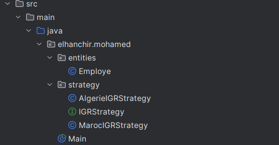
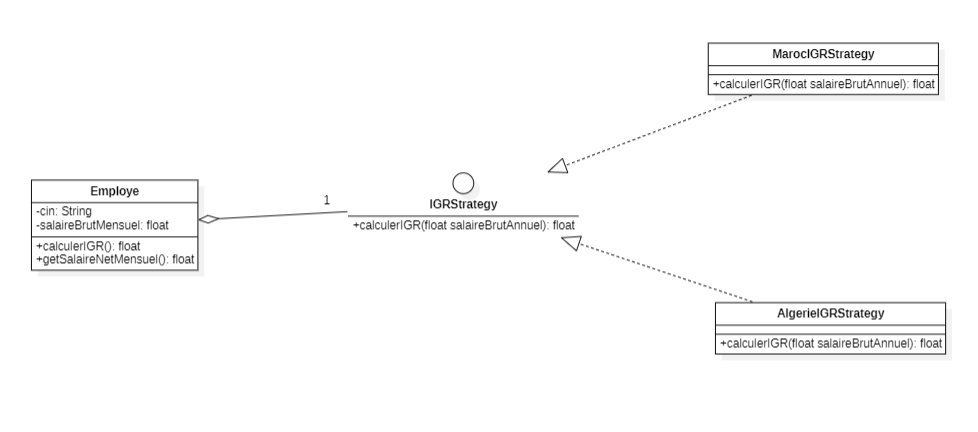

# Implémentation Dynamique de la Stratégie IGR

Ce projet démontre l'utilisation du Pattern de Conception Stratégie pour calculer dynamiquement l'impôt sur 
le revenu (IGR) des employés, en fonction des règles spécifiques à chaque pays. Il offre la flexibilité d'ajouter 
de nouvelles stratégies de calcul d'IGR sans modifier la classe de base Employe.

## Fonctionnalités

- **Sélection Dynamique de Stratégie :** Les utilisateurs peuvent sélectionner dynamiquement une stratégie d'IGR lors de l'exécution.
- **Extensibilité :** De nouvelles stratégies peuvent être facilement ajoutées sans modifier le code existant.
- **Application Console Interactive :** Le programme interagit avec l'utilisateur via la console pour saisir les détails des employés et sélectionner la stratégie fiscale souhaitée.

## Architecture

### Packages

### Diagramme de Classe

